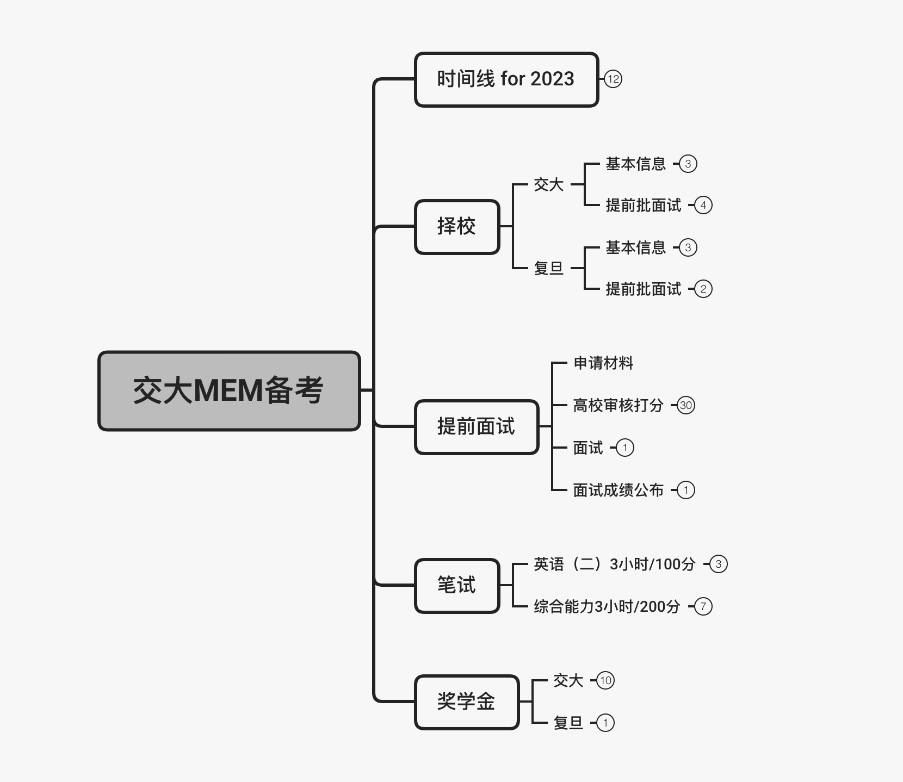
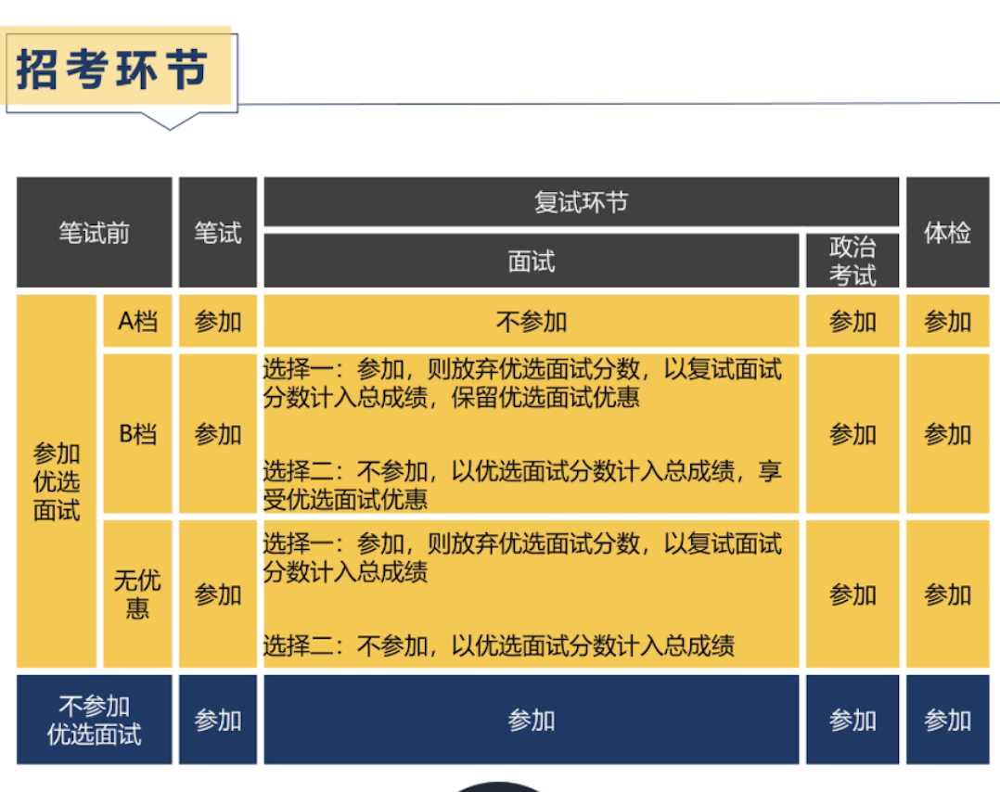
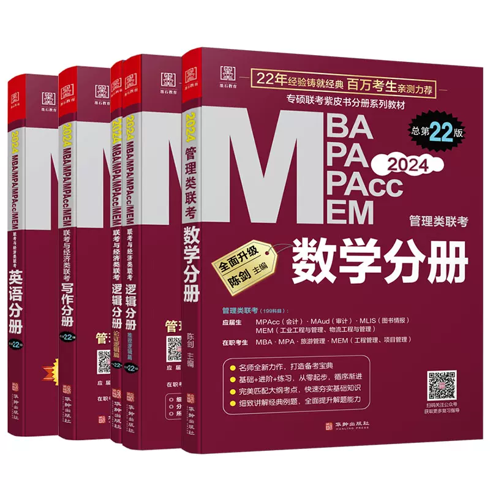
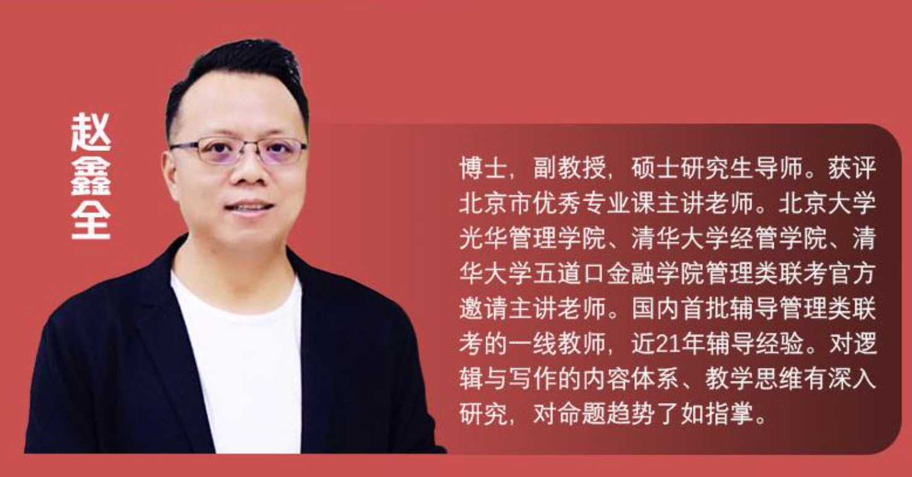
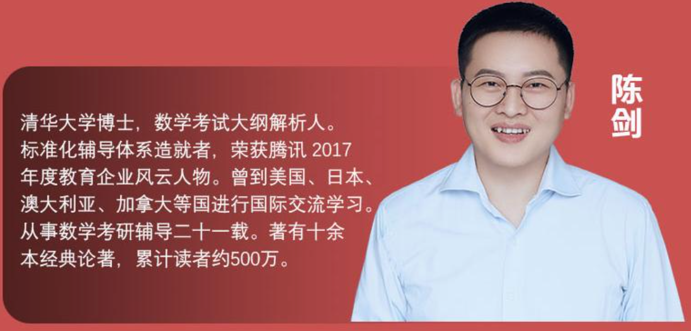
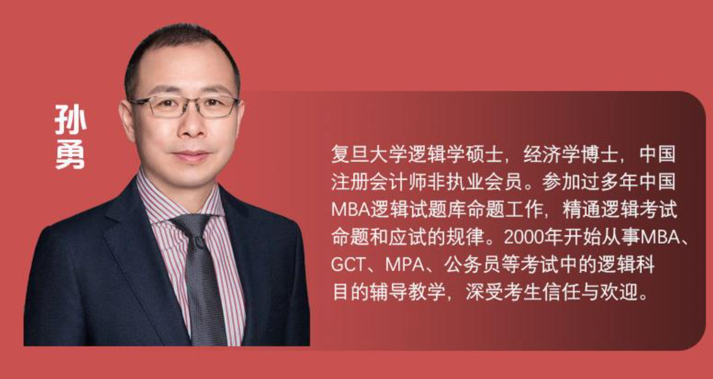
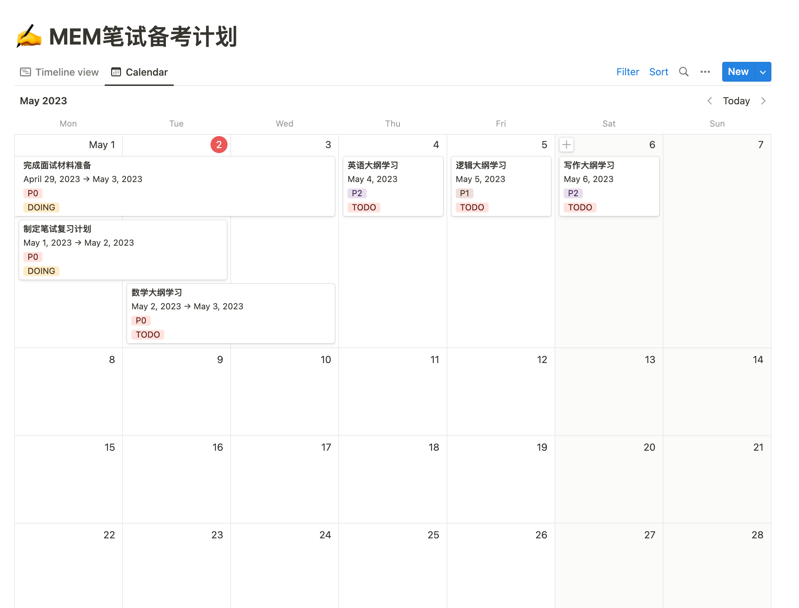

MEM ：Master of Engineering Management，工程管理硕士，专业硕士学位。

记录 2024 年交大 MEM 到备考过程，包括前期的调研、提前批面试 、笔试学习资料准备、学习计划制定等，所有和 MEM 相关的事情都会汇总到这里。

- MEM 择校，交大 or 复旦
- 2024 MEM 的关键时间线
- [[上海交大2024年MEM优选面试A档经验|提前批面试]]
- 笔试学习资料
- 笔试备考计划

如果需要详细的思维导图，可以添加个人微信 **imesong2012** ，备注 **交大MEM备考**，一起学习交流，共同上岸。

<!--more-->

## 目标学校选择

学校选择，前期锁定交大和复旦，没有再调研其他学校的硕士研究生信息，开始有点纠结 MBA 还是 MEM，学校选择交大和复旦个人感觉差异不是很大。
参加了几场交大、复旦的MBA、EMBA、MEM 的招生说明会，同时和几个在交大读EMAB、MBA、MEM 的朋友了解后，决定报考交大的 MEM 。
交大和复旦 MEM 的一些基本信息对比如下，仅供参考，复旦的部分数据来自2022年的历史统计，没有查找到2023年的最新政策说明。

| 基本信息   | 交大                                                                            | 复旦           |
| ---------- | ------------------------------------------------------------------------------- | -------------- |
| 学费       | 23.8万                                                                          | 19.8万         |
| 学制       | 2.5年                                                                           | 2年            |
| 招生规模   | 400人                                                                           | 80人           |
| 招生方向   | 项目管理方向                                                                    | 项目管理方向   |
| 学院       | 电子信息与电气工程学院                                                          | 信息与工程学院 |
| 奖学金     | 状元 8万、榜眼 5万、探花 3万， 卓越 1%（约4人）2万， 优秀 4%（约16人）1万 | 暂无信息       |
| 提前批面试 | 有                                                                              | 有             |

[上海交大电院2024级MEM招生优才选拔](https://mem.seiee.sjtu.edu.cn/mem/info/35507.htm)

[复旦信息与工程学院MEM招生简介](http://www.it.fudan.edu.cn/Data/View/4138)

## 2024 MEM 时间线

如果准备参加交大 2024 年入学的 MEM 考试，包括提前批面试、笔试、复试，一些关键事项的时间点如下，以**交大**为例，其他学校略有差异。

| 时间                           | 关键事项     | 备注                                   |
| ------------------------------ | ------------ | -------------------------------------- |
| 2023年3月 - 2023年10月         | 提前批面试   | 各个批次的具体时间参考 提前批面试 表格 |
| 2023年10月5日 - 2023年10月25日 | 网上报名     |                                        |
| 2023年12月23日                 | 笔试联考     |                                        |
| 2024年3月                      | 笔试成绩公布 |                                        |
| 2024年4月                      | 复试         |                                        |
| 2024年9月                      | 入学         |                                        |
| 2027年3月                      | 毕业         |                                        |

## 提前批面试

交大的提前批面试一共有 4 批，每批次的时间安排如下

| 批次         | 报名截止时间      | 面试时间   |
| ------------ | ----------------- | ---------- |
| **第一批次** | 3月20日           | 四月中上旬 |
| **第二批次** | 5月1日 - 6月5日   | 六月中旬   |
| **第三批次** | 8月1日 - 9月5日   | 九月中下旬 |
| **第四批次** | 9月10日 - 10月5日 | 四月中下旬 |

面试考核主要包括两部分：考试履历评分和面试表现评分，两个结合得出提前批面试总分。

### 考生面试材料评分

通过不同纬度，评估考生，最终给出是否合适该校 MEM 的招生，影响考生的录取总分。评估的维度相对客观，也存在操作的可能。

#### 教育背景

#### 工作履历

### 单位规模地位

- 世界 500 强
- 行业龙头企业
- 部分细分行业龙头企业

#### 个人背景

- 工作年限
- 管理经验
- 下属人数
- 职务级别
- 年薪收入

#### 专业资格证书

- 大学期间获得证书

  - CET4 / CET6
  - 雅思 / 托福

- 工作期间获得
  - CFA / CPA / PMP

#### 荣誉奖励

- 大学期间
- 工作获得
- 社会团体

#### 推荐信

2封推荐信，了解别人对你的评价，倾向于对自己比较了解的朋友、同事，最好有一定的社会地位，在公司担任一定的管理职务，优先考虑交大的校友。

#### 职业规划

了解考生的职业目标是否清晰，报考动机是否合理

#### 论文短述

通过短篇论文的方式，了解考生对所在的行业认知，观察考生的领导力，对未来的学习规划。

#### 其他

个人特长和兴趣爱好

### 主要面试内容

面试的内容，围绕应聘者提交的材料，考察应聘者的**专业背景知识**、**工作业绩**、**英语水平**、**研究计划与职业规划**、**综合素质**。

面试采用 多 v1 的形式，即有三名面试考官，同时对 1 名考生进行考评，单个考生面试时长在 20min ～ 30min 之间，中文为主，有 3min ～ 5min 的英文自我介绍。

### 面试结果

正常情况下，面试后 7 个工作日，会公布面试结果。交大的面试成绩分为三档

- **A 档**：笔试成绩达到交大的合格线，政治考试、体检合格，**可获得拟录取资格**。参加提前批面试，目标也是为获取拟录取资格，不用再参加复试。
- **B档**：笔试成绩达到交大的合格线，政治考试、体检合格，以笔试分数+优选面试分数（或复试分数）的总成绩排名，**同等条件下优先获得拟录取资格**（优选面试分数或者复试分数低于120分不录取）
- **普通档**：笔试成绩达到交大的合格线，政治考试、体检合格，以笔试分数+优选面试分数（或复试分数）的总成绩排名，**从高到低择优录取**（优选面试分数或复试分数低于120分不录取）

## 笔试

笔试包括两场考试，管理类综合和英语，每场考试各 3 个小时。管理类综合共 200 分， 英语 100分，笔试总计 300 分。

### 管理类综合

管理类综合 200 分为 3 部分，数学 75 分、逻辑 60 分、写作 65 分。

- 数学：25道选择题
- 逻辑：20道选择题
- 写作：小作文、大作文

[[MEM-MAB-管理类综合考试大纲]]

### 英语

英语 100 分，考察 4 个部分，完形填空 10 分、阅读理解 50 分、翻译 15 分、写作 25 分。

[[MEM-MBA-英语考试大纲]]

## 笔试学习资料

### 教材

看到其他同学分享的经验，教材普遍选用的是机械工业出版社的 MBA/MEM/MPA 通用教材，红皮书。

**数学 - 陈剑**
**写作 - 赵鑫全**
**逻辑 - 孙勇**
**英语 - 新东方**

## 笔试备考计划

工作中习惯了 OKR 工作法，MEM 备考这个事情，有清晰的目标，明确的考核标准，尝试使用 双月OKR 的思路辅助达成最终目标。
**时间投入**：每周最少 15 ~ 20 个小时的备考时间。

- 周一至周五：1hour × 5 = 5hour
- 周六：5 ~ 10 hour
- 周日：5 hour
- 总计：15 ~ 20 hour

从 5月1日 起至 12 月 22 日，总计可投入的备考时间约60hour，换算成自然日（每天8小时）约 62.5天 ～ 82.5天，在 2 个月到 2个半月之间。细算下来，时间不是特别多。

### 双月备考 OKR

围绕数学、逻辑、写作、英语四个方向，以双月维度评估备考计划的完成度。

### 详细备考计划

详细的备考计划还在制作中，会在学习过程中不断完善，整体思路是先数据、逻辑，后英语、写作。

