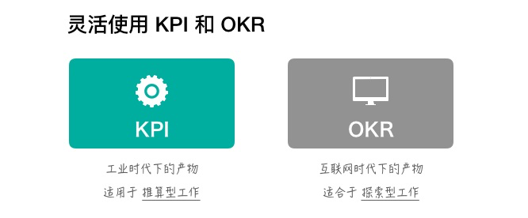
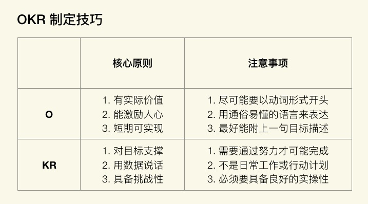

## OKR 的发展历史

<!--more-->

## OKR 的基本原则

Objectives &KeyResult

- 目标管理工具

- 绩效管理工具

- 沟通工具

- 人才激励工具

**是一个工具,背后代表在一种管理理念和思维方式**

## OKR的数据结构

## OKR 三板斧

1. 制定 OKR：自顶向下地制定目标，自底向上对齐目标。

2. 执行 OKR：唯有做到持续追踪、持续更新，才能做到拥抱变化。

3. 评估 OKR：周期性地评估和复盘，持续改进、持续迭代。

1. OKR 不仅是目标管理工具，也是激励与沟通工具。

2. OKR 的概念比较容易理解，但内涵却充满了许多人性和智慧。

3. OKR 适合在环境多变的时代下，用敏捷精神去拥抱变化。

## OKR 与 KPI 区别

KPI：Key Performance Indicator(关键绩效指标)

OKR：objective & Key Result（目标和关键结果）

- 关注对象：OKR 关注的是目标是否达成，而 KPI 关注的却是结果是否完成。OKR 的目标野心勃勃和无限挑战，而 KPI 体现的是制定的指标是否可以达标。

- 核心原理：OKR 的核心原理在于“目标对齐”，而 KPI 的核心原理却在于“指标分解”。

- 实操过程：OKR 是鼓励员工自己去制定目标，能激发其主观能动性，而 KPI 却是领导去下达指标，员 工去接受任务，中间难免会有“讨价还价”的过程。

- 用户行为：OKR 让我们更愿意主动地挑战，而 KPI 却让我们不得不被动地执行。

- 利益关联：OKR 与利益不直接相关，而 KPI 却与利益挂钩。
  

## OKR 可以取代 KPI 吗？

OKR 是目标管理工具，KPI 是绩效管理工具，那么在管理中所有的目标是绩效吗？

目标包括绩效，但不局限于绩效。绩效是组织期望的结果，但目标还包括个人成长

推算型工作更适合用 KPI，探索型工作更适合用 OKR。

1. OKR 与 KPI 关注点不同，前者更注重过程，后者只在意结果。

2. OKR 无法取代 KPI，也没有必要取代 KPI。

3. 需要充分发挥我们身上的领导力，将 OKR 与 KPI 相结合，让价值最大化。

## OKR 落地的条件

### 面对沟通时，是否公开透明

- 在目标“制定”过程中，通过跟自己的上级、平级、下级沟通，从而实现目标对齐。

- 在目标“执行”过程中，我们需要不断跟踪目标的进度，一旦有调整就需要及时沟通。

- 在目标“评估”过程中，我们需要对目标进行评估和复盘，需要跟团队一起开会讨论，这又会产生更进一 步的沟通。

### 面对交付时，是否信守承诺

当我们制定 OKR 时，本质上就是在制定目标，而这些目标很大程度上，恰恰代表了我们自己对团队的一种承诺。

如果我们在制定OKR 时已经做出了承诺，而后又很随意地推翻了当初的承诺，最终对此事也没有跟大家同 步想法，更没有什么有效反馈，不过是几句轻描淡写，此事就这样过去了。那么，OKR 的价值实便不存在 了

### 面对压力时，是否勇于挑战

当你制定 OKR 时，如果都是按照自己最安全的角度来制定目标的话，多数会出现这样一种现象：最终，根 据你所制定出的OKR 评分标准，大家几乎都能拿满分。

它所暴露出来的本质问题：这样也就把 OKR 做成“自定义 KPI”了， 从而很大程度上失去了使用 OKR 的实际意义。

团队内驱力强的团队，非常适合 OKR。

从 **个人成长**、**团队贡献**两个角度考察团队内驱力

- OKR 对内驱力强的人有价值，我们应该先让那 20% 的人用上 OKR，再去努力提升他们的领导力，最后让他们影响剩余 80% 的人，最终大家顺理成章地就都用上了 OKR。

- OKR 是自驱力较强的人自我成长的利器。

## OKR 怎么对齐

对齐一定 是 O 与 O 之间的支撑关系，与 KR 没有任何直接关系。

OKR 的目的在于“聚焦”，而手段在于“对齐”，我们需要深刻理解“对齐”二字的真实含义，以 及“对齐”与“分解”的区别，这对我们实践 OKR 起到了至关重要的作用。

1. 我们做任何事情（包括加班）都要有目标，凡是有目标的，就能使用 OKR。

2. 制定 OKR 绝不是拿团队的 KR 作为自己的 O，而是用自己的 O 去对齐团队的 O。

3. 公司每个人都要有自己的“个人 OKR”，我们都应该为自己所在的团队而贡献力量。

## 如何制定 OKR

### Objectives

O 是 OKR 中“What”的层面，它解决了“做什么”的问题。

- O 尽可能要以动词形式开头。

- O用通俗易懂的语言来表达。

- O 最好能附上一句目标描述。

> 2021 年 Q1 团队目标
> O1：打造能让每个人都喜爱的工程师文化
> 描述：希望能提升工程师团队的凝聚力，让每个人在团队中都能得到成长，并为加入我们的团队而感到骄傲，因此，我希望大家能一起打造让我们团队每个人都喜爱的文化。

### KeyResult

KR 是针对OKR 中“How”的层面，它解决了具体“怎么做”的问题。O 是定性的，KR 是定量的。

KR 对 O具有支撑作用。KR完成了，O 也应该完成。
**KR 的三条核心原则**

1. KR要支撑目标，需要与 O 直接关联。

2. KR 用数据说话，需要通过数据去度量，符合 SMART 原则。

3. KR 具备挑战性，难易度设置需要恰到好处。
   **KR 制定时注意事项**
4. KR 需要通过努力才可能完成。可能是实现难度较大，或者是它的时间成本较大。

5. KR 不是日常工作或行动计划。实际上，KR 是完成一系列任务后才能得到的结果。

6. KR 必须要具备良好的实操性。当写完一条 KR 后，试着经常问自己“这条KR应该如何去实操呢？”。
   

7. O 要能聚焦。既要明确方向，又要激励人心。
8. KR 要有意义。既要能够度量，又要能够支撑目标。
9. OKR 制定过程，可以将其视为一个项目，并从项目管理中追求效率的提升。

## OKR的执行

动态变化的，需要定期回顾执行情况

1. 建议我们做到“每天更新、每周回顾、每月优化、每季复盘”。具体来说就是，每天更新自己的 OKR 完 成进度，每周对自己的 OKR 做一次回顾，每月对自己的 OKR 做一次优化，每季对团队和个人的 OKR 分 别做一次复盘，逐渐养成习惯。

2. 建议在周会上每个人向团队同步一次自己的 OKR 执行进度，让彼此之间能看到各自的 OKR 在往前进行， 每个人充分享受成长和贡献所带来的快乐。

3. 建议每月我们开一次 OKR 交流会，在会上允许对自己的 OKR 内容进行更新，若其他人的 OKR 可能受影 响时，我们就在这次会上进行探讨。

你可以不修改任何内容、进度、信心指数，但一定要每周做一次查看和思考

## OKR高效执行的方法

1. OKR 需要设一个固定的执行周期，我们可以将此周期定为 2 个月。

2. 将 OKR 制定完毕后，必须定期对它的内容、进度、信心指数进行更新和同步，这样才能最大化避免 OKR 更新不及时，从而导致信息不对称的风险。

3. 只有将 OKR 与自己的日常工作任务关联起来，并通过任务去驱动 OKR 完成，才能提高执行效率，达到高效。

将任务与 OKR 之间看成是一个“二级驱动”关系，即任务驱动 KR 的完成，进而促使KR 驱动 O 的达成。

1. 执行力有多强取决于领导力有多强，而领导力需要在立即作出决策时发挥作用。

2. 无论使用多么先进的工作法，缺乏有效的过程跟踪，就是在给自己挖坑。

3. 在团队中引入OKR，一定要和原有工作流相结合，OKR才能顺利落地。

## OKR 评估

### 简化OKR评估标准

- 1.0 分：不可能做到，但实际做到了。

- 0.7 分：希望能做到，实际也做到了。

- 0.3 分：肯定能做到，实际也做到了。

- 0 分：肯定能做到，但实际没做到。

举个例子，以你自己的经历来看，一个月最多只能精读 1 本书，而你希望一个月可以花更多的时间去阅读，因此你可以制定这样的 OKR：

> O：充分享受阅读所带来的乐趣
> KR：一个月看 5 本书

- 这个 KR 对于你目前而言是不可能做到的，如果你实际上做到了，在 OKR 评估时，你就可以对该 KR 评 1.0 分，因为这件事儿对于你的挑战简直是超乎想象的，结果你却奇迹般地做到了。

- 如果你将 KR 写为“一个月看 1 本书”，这是你肯定能做到的事情，加入你实际上却没做到的，那么就只 能评 0 分；如果做到了，就只能评 0.3 分，因为这是你力所能及的事情，对你而言几乎没有什么挑战，那 么评分也不可能很高。

- 如果你认为应该去挑战一下自己，但又不希望最终的结果离期望相差太远，那么你可以将 KR 写为“一个 月看 3 本书”；如果你做到了，那么你也只能得 0.7 分，因为挑战还不够大，你的得分也不会很高。

OKR 评分标准的定义，没有太多的分值选项设置，只有 0、0.3、0.7、1.0 四种分值选项，你只需给自己一定挑战，最后根据客观事实做出评估即可。

**OKR 评估方式就是自评，而OKR 评估也是自我管理的有效手段。**

1. OKR 评估必须落实和体现在自我层面上，自己制定的 OKR 就需要由自己去评估。

2. 让复杂过程简单化，OKR 评分其实根本没有想象中那么难。

3. OKR 评估过程在本质上是对自我管理的一种体验，进而提升管理能力，这都需要从自我评估开始。

OKR 评估是给自己看的，而不是给别人看的，更不是拿来做比较的，我们应该为自己所制定的目标负责

## OKR 复盘

1. 审视目标

2. 回顾过程

3. 分析得失

4. 总结规律

## 审视目标

为何当初你要制定这样的目标，而不是其他目标？你所制定的目标现在达成了吗？如果没达成，现实和预期之间的差距在哪里呢？

## 回顾过程

整个目标执行过程是如何执行的？你大致分为几个阶段去执行？每个阶段中发生了什么重要事件？

## 分析得失

在这次在这次 OKR 周 期中，哪些方面你做得很好？为什么好？哪些方面你做得不够好？为什么不好？

## 总结规律

如果再次做同类事情，如果再次做同类事情，你会怎么去做？对我们后续的工作有何指导？我们收获了哪些规律、原则、方法论？

1. 复盘能帮助你看清 OKR 执行过程中的每一个步骤，帮助团队深刻体会 OKR 所带来的价值。

2. 复盘不是简单地回顾和总结，需要借助一套严谨且合理的方法论，才能让复盘变得更有意义。

3. 如果 OKR缺少了复盘，不仅会让你频繁踩坑，还会让你失去一次锻炼和展示自己领导力的绝佳机会。

## 技术团队的价值

项目管理的价值仅在于让项目顺 利上线，至于项目是否产生应有的价值，似乎就无法控制了。

## 向上管理

向上管理，管理的其实是领导对你的期望。

1.做⼀名“被领导者”，需要发挥⾃⼰的智慧，充分挖掘出领导对你的期望。

2.产品经理管理的是⽤⼾对产品的期望，你需要管理的是领导对你的期望。

3.OKR是⼀种管理思维，只要双⽅认可OKR的价值，就能快速达成共识。

## 中层管理

企业的发展⽅向取决于创始⼈，但企业的经营节奏却取决于管理者。尤其对于中层管理者⽽⾔，上 有⾼层领导，下有基层团队。更加形象地来说，⾼层领导是企业的“头部”，基层团队是企业的“腿部”， 那么中层管理者就是企业的“腰部”。

### 中层腰虚的表现

- 团队执⾏⼒不强。⾼层说中层缺乏能⼒，中层说基层能⼒不够，对下级总是不认可。

- ⾼层对基层交付结果不满。⾼层认为是中层没传达好，中层说是基层没执⾏好。

- 基层出现⽆法解决的问题。久⽽久之，就会逐级上升，直到⾼层介⼊，⾼层会认为中层能⼒不⾏。

- 中层之间关系不和谐。经常互怼，甚⾄相互伤害，所带领的团队也出现“抱团”现象。

- 中层抗压⼒不够或内⼼不够强⼤。经常给基层制造负⾯情绪，导致团队吐槽不断。

## OKR 落地过程中常见问题

OKR只是一个目标管理工具，这个工具在团队中是否能够发挥作用，发挥怎么样的作用，完全取决 于使用工具的你

- 将 OKR 用于绩效考核

- 用 KPI 思维做 OKR

- O 数量太多，不够聚焦、

- KR 不够量化，无法评估

- 将 KR 当成行动计划或待办任务

- 忽略 OKR 向上对齐和水平对齐

- 忽略 OKR 更新和复盘

- 忽略 OKR 评分环节

- 认为 OKR 可取代 KPI

OKR 不与绩效考核相关，不与奖金或薪资直接挂钩。

OKR 是公开透明的，每个人都能看到所有人的 OKR。

OKR 要有评分，评分不是越高越好，越高说明挑战越不够。

OKR 目的在于让事情变得聚焦，在正确的轨道上做出努力。

OKR 是工作法，也是管理方法，它能激励团队取得成功。

OKR 需做出承诺并付出行动，它是思想，也是文化。

链接:

[https://pan.baidu.com/s/1KQNWE8-R_YyhtyGblmMZ_w](https://pan.baidu.com/s/1KQNWE8-R_YyhtyGblmMZ_w)

提取码: y3ku 复制这段内容后打开百度网盘手机App，操作更方便哦
