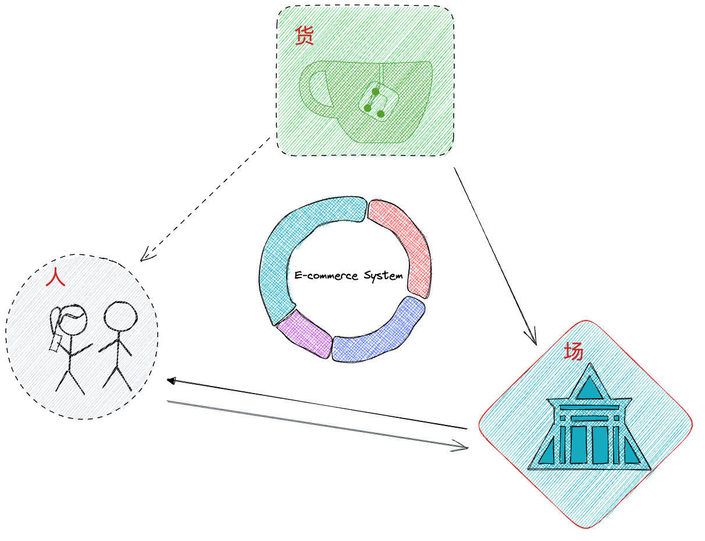
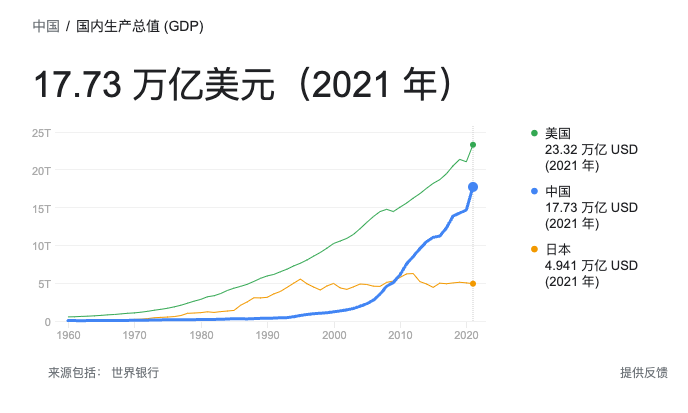
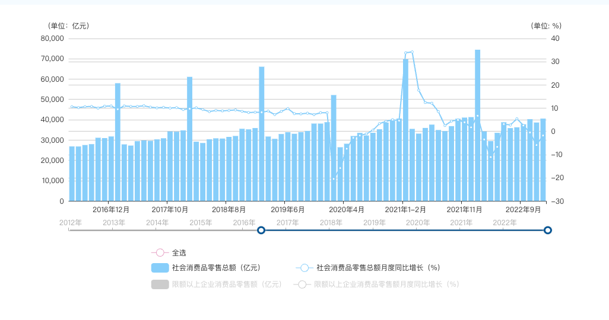

电商是一个比较复杂的业务 ，电商行业的模型，在各个公司、各个阶段表现不一样。电商业务的参与者，围绕着 **人-货-场** 解决各个域的问题。

<!--more-->

## 人（流量供给）

货最终是要卖给人的。没有流量（人），货就没有去向。
为什么说阿里电商是流量的黑洞呢？

## 货（商品供给）

商家、商品端，包括供应链、物流等，都是围绕 B 端提供服务。

## 场

人 与 货 产生关联的地方。
在场中，达成人、货交易。

## 货架电商

货架，类似大卖场，商品固定在各个场景中，人在其中浏览、逛、搜索，最终找到想要商品。大卖场里会有不同的专区，有折扣区、会员区、品牌区等。

## 直播电商

直播电商，也是一种场，本质上没有区别，只是在人-货建立关系方式上发生了些许差异。直播场景会提供多种货触达人的方式。通过主播讲解、小黄车、讲解卡、福袋、各种直播道具等。在货架场景，也有货找人的方式，如推送、短信召回，但效率、转换率没有直播高。

线下卖场中，有些商品区域(牛奶、生鲜等)会有推销员介绍一些新品、打折促销活动等。这些场景，和直播电商有类似的功能，主动提供 货->人的方式，互动性也比较强。

## 电商指标体系

### GDP

国内生产总值

反应一个国家的综合经济能力，中国 100 万亿人民币，非中国家合计 500 万亿人民币，数据来自[2022年世界银行统计](https://data.worldbank.org.cn/country/china?view=chart)

### 社会消费品零售总额：GDP \* 社零占比

**社会消费品零售总额**
指企业（单位、个体户）通过交易直接售给个人、社会集团非生产、非经营用的实物商品金额，以及提供餐饮服务所取得的收入金额。个人包括城乡居民和入境人员，社会集团包括机关、社会团体、部队、学校、企事业单位、居委会或村委会等。

以上数据来自[国家统计局](http://www.gov.cn/shuju/hgjjyxqk/xiangqing/tcg.html) 官方网站

#### [社零占比](http://www.gov.cn/xinwen/2022-05/21/content_5691590.htm)

> 新华社北京5月20日电（记者 谢希瑶、王雨萧）这十年，我国扩内需促消费取得新进展，消费模式不断创新，网络零售市场发展壮大。2021年全国网上零售额13.1万亿元，比2012年增长9倍。2021年实物商品网上零售额10.8万亿元，占社零总额比重达**24.5%**，规模居世界第一。

### 电商收入

电子商务的收入 = 社会消费品零售总额 \* 货币化率

#### 货币化率

- 中国 30%
- 其他国家 10%-30% 不等

## 电商变现方式

- 会员费（用户）
- 消费贷（用户）
- 佣金（商家）
- 广告（商家）
- 物流配送（商家）
- 支付（商家）
- 商家融资（商家）
- 仓储（商家）
- 供应链提效（商家、生产商）
- App Store 分成（开发者）

## 电商行业玩家

- Amazon
- Alibaba
- JingDong
- PinDuoDuo
- eBay
- SheIn
- Shoppe
- Lazada
- AliExpress
- Coupang

## 业务指标

### GMV

\**GMV = PV *CTR* C_O * AOV

= 用户量 _ARPU
= 流量_ 转化率\* 客单价

PV：流量供给
CTR：货的供给、场的转化率、
AOV： Average order value ,平均订单价值，客单价

### UV 转化率

### 流量供给

- UV、PV
- DAU
- DAC
- 电商渗透率 DAC/DAU
- LTV
- RPD

- 转化率
- CTR
- CVR
- 复购率

- 补贴率

- NPS: 净推荐值，评价用户忠诚度

## 业务知识

### SKU

**Stock Keeping Unit ,物理上不可分割的最小存货单元。**

> SKU：土豪金 16G 苹果 6（商品的不可分割的最小单元）。

### SPU

**Standard Product Unit ,商品聚合信息的最小单元，是一组可复用、易检索的标准化信息的集合，描述一个产品的特性。**

> SPU: 苹果15（商品聚合信息的最小单位），手机→苹果手机→苹果 15，苹果 15 就是 SPU。

- CPC: cost per click, 按点击付费。
- CPA: cost per action, 按行为、效果付费，单个下载、激活的成本。
- CPM : cost per mille , 按千次曝光付费。比较常见的推广方式，99元/CPM, 每 1000 个用户看见推广的广告，需要给推广商 99 块。可以有效的增加曝光率。
- CPS: cost per sales , 通过实际销售量进行收费，比较适合购物类 App 推广
- CPT: cost per time , 通过时间进行收费，类似包月。
- LTV：LTV_30,LTV_all，用户生命周期价值，一般会带上时间限制。如 30 天内用户产生的价值。
- CAC：customer acquisition cost, 用户获取成本，广告场景下等同于 CPA
- PBP：payback period ，投资回收期，指从项目投建之日起，用项目的净收益偿还原始投资所需的时间。
- ROI: 投资回报率

### 流量成本

- 货架电商和直播电商的获客成本，哪个更高？

直播电商是一种新的营销方式？

- 提高营销的效率
- 降低成本

> 个人思考
>
> **电商的本质是交易**
> 用户拥有的金钱、时间、经历 -> 商家的货品、服务

### 电商系统的三个核心

**信息流**
信息发布、信息流转、信息交换的全过程。
商品信息的流转，商家 -> 平台 -> 用户；用户决策信息流转，用户 -> 平台 -> 商家。

**资金流**
消费者将钱给到商家的过程，为了解决信任感问题，引入担保交易模式，包括退还等逆向流程。以及在基础交易之上的分佣、分账、出资等

**物流**
商品的流转，将物权从商家转移到消费者手中。跨境物流包括报关、出关、报税等流程。

### 商品

## 正向交易

转化率相关

- 加购率
- 立购率
- 提单率
- 地址页
- 支付率
- 创单率

全链路的转化指标

UG 场景下，影响提单页转化率的核心因素是邮费，是否包邮？商品价格反而不敏感

## Question

- [x] 拼多多为什么没有购物车？ ✅ 2023-07-19

关注公众号 **技术后花园** 获取更多信息

