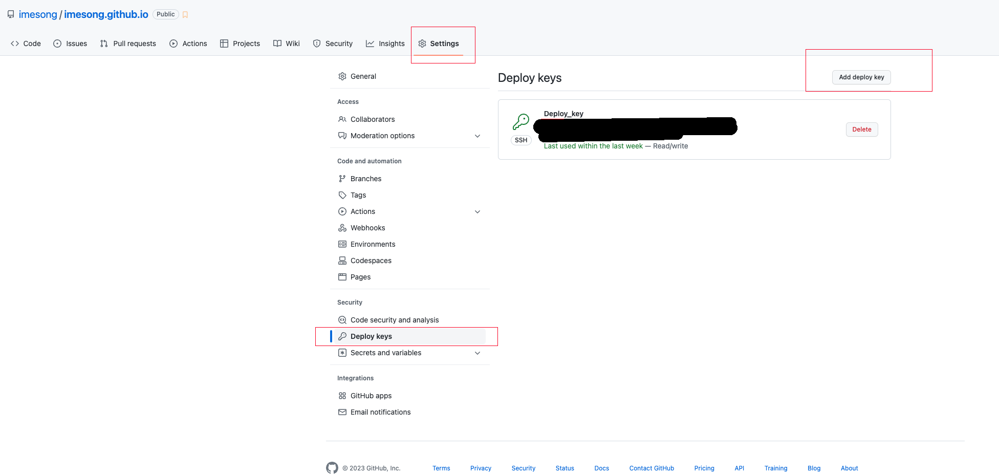
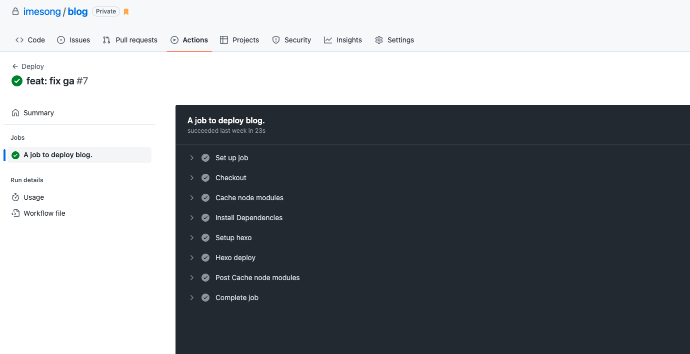

## 背景

最近在整理资料时，发现2年前备份的hexo 网站的 `md` 源文件，才发现，自己的个人站点，已经2年多没有更新了，上次更新还是在2020年，在前司的办公电脑上操作的。趁着最近整理资料的契机，将个人博客重新部署、升级。

## 目标

- [x] 迁移 hexo 源文件、配置
- [x] 升级hexo 版本、Next 主题版本
- [x] CI/CD ,github page 自动更新 ^832567
- [x] hexo 源文件，相关的配置备份;源文件多端同步，能够在不同的电脑、终端编辑博客
- [x] 多平台发布
  - [x] [hexo博客](http://www.imesong.com)
  - [x] 微信公众号

<!--more-->

## hexo 文件迁移

翻箱倒柜，从移动硬盘上找到了3年前备份的hexo目录，当时保险起见，把整个安装包备份了下来。hexo 博客下面几个目录/文件比较关键，只要这几个东西在，就能快速的重新把hexo搭建起来。

- `source` 目录下的源文件
- `config` 配置文件
- `theme` 中的主题配置文件
- `package.json` node 依赖

1. 把之前备份的整个目录 copy 到现在电脑上，删除 `node_modules` 目录
2. 执行 `npm install` 安装相关依赖
3. `npm install hexo-cli-g`
4. `hexo server` , 惊喜的发现，本地可以直接运行起来。有一个多语言适配的问题，后面再解决。

## hexo 版本升级

hexo 版本升级过程比较简单，主要是更新相关的依赖内容
升级之前的版本信息

```shell
➜  imesong hexo version
(node:41891) Warning: Accessing non-existent property 'lineno' of module exports inside circular dependency
(Use `node --trace-warnings ...` to show where the warning was created)
(node:41891) Warning: Accessing non-existent property 'column' of module exports inside circular dependency
(node:41891) Warning: Accessing non-existent property 'filename' of module exports inside circular dependency
(node:41891) Warning: Accessing non-existent property 'lineno' of module exports inside circular dependency
(node:41891) Warning: Accessing non-existent property 'column' of module exports inside circular dependency
(node:41891) Warning: Accessing non-existent property 'filename' of module exports inside circular dependency
hexo: 4.2.1
hexo-cli: 4.3.0
os: darwin 21.6.0 12.6

node: 18.7.0
v8: 10.2.154.13-node.9
uv: 1.43.0
zlib: 1.2.11
brotli: 1.0.9
ares: 1.18.1
modules: 108
nghttp2: 1.47.0
napi: 8
llhttp: 6.0.7
openssl: 3.0.5+quic
cldr: 41.0
icu: 71.1
tz: 2022a
unicode: 14.0
ngtcp2: 0.1.0-DEV
nghttp3: 0.1.0-DEV

```

看了下 [hexo 官网](https://hexo.io/docs/)最新的版本已经升级到了 6.3。升级过程如下

```shell
//以下指令均在Hexo目录下操作，先定位到Hexo目录
//查看当前版本，判断是否需要升级
> hexo version

//全局升级hexo-cli
> npm i hexo-cli -g

//再次查看版本，看hexo-cli是否升级成功
> hexo version

//安装npm-check，若已安装可以跳过
> npm install -g npm-check

//检查系统插件是否需要升级
> npm-check

//安装npm-upgrade，若已安装可以跳过
> npm install -g npm-upgrade

//更新package.json
> npm-upgrade

//更新全局插件
> npm update -g

//更新系统插件
> npm update --save

//再次查看版本，判断是否升级成功
> hexo version
```

## Next 版本升级

主题的升级过程稍显复杂，Next 主题从 7.8 版本升级到最新的 8.2 , 中间有 break changes，有一些配置文件需要手动 copy。升级步骤参[Next官方文档](https://theme-next.js.org/docs/getting-started/upgrade.html)。

> [!NOTE] Breakking Changes
> There are some breaking changes that need attention when upgrading across versions.
>
> 1.  Update language configuration (for Simplified Chinese)
>     Since v6.0.3, `zh-Hans` has been renamed to `zh-CN`: [https://github.com/theme-next/hexo-theme-next/releases/tag/v6.0.3](https://github.com/theme-next/hexo-theme-next/releases/tag/v6.0.3)
>     Users upgrading to v6.0.3 and later need to explicitly modify the `language` configuration in Hexo config file, otherwise the language display is incorrect.
> 2.  Since v8.0.0, all libraries under the `next/source/lib` directory was moved out to [@next-theme/plugins](https://github.com/next-theme/plugins). Please see this article for the new 3rd-party libraries installation method: [Adding Plugins](https://theme-next.js.org/docs/third-party-services/#Adding-Plugins).

> [!NOTE] Next 主题官方升级步骤
> NexT suggest to upgrade from version 5 or 7 to version 8 in this way:
>
> 1. You need to do some copies of old NexT files:
>    1.1. `_config.yml` or `next.yml` (if you used [Alternate Theme Config](https://theme-next.js.org/docs/getting-started/configuration.html)).
>    1.2. Custom CSS files placed in `next/source/css/_custom/*` and
>    `next/source/css/_variables/*` directories.
>    1.3. Custom layout files placed in `next/layout/_custom/*`.
>    1.4. Any another possible custom additions which can be found by compare tools between repositories.
> 2. Then rename the old NexT folder, for example, rename `next` to `next-old`.
> 3. Install the new version according to the method provided in this article: [installation instructions](https://theme-next.js.org/docs/getting-started/installation.html). Run `hexo clean` and `hexo s` to check whether the site works correctly.
> 4. Update Hexo and Hexo plugin
>    If after completing the above steps, an error occurs when executing `hexo s` or `hexo g`, it means that there may be a conflict between the old version of Hexo / Hexo plugin and the new version of the theme NexT. We recommend upgrading Hexo and Hexo plugins to the latest version. You can run `npm outdated` to see all the upgradeable plugins.
> 5. If you see any bugs or you simply does not like this version, you can switch back to the old version at any time.

## github action CI/CD 自动部署博客

^bc6fa0

[github action](https://docs.github.com/en/actions) 的介绍，可以参考官网。通过 github 提供的 CI/CD 的能力，自动部署blog的工作流程如下：

 ^a5f3af

整体流程介绍

1. 本地完成文章编辑，通过 git push 提交变更到私有仓库 imesong/blog
2. imesong/blog 的 github action 捕捉到 push 事件，触发自动部署流程
3. 部署流程完成后，将编译产物 push 到 imesong/imesong.github.io 的公共仓库
4. 再次访问 imesong.com 时，会自动更新到最新的部署内容

### github action 配置

1. imesong/blog 的仓库需要配置 github action 的能力，在项目的根目录下新建 `.github/worflows/deploy.yml` 的文件。github 会根据 deploy.yml 中配置的脚本，执行 workflow。 完整的脚本内容如下，具体的解释可以看官方文档。

```yml
name: Deploy

on:
  push:
    branches:
      - "main"

jobs:
  build:
    runs-on: ubuntu-latest
    name: A job to deploy blog.
    steps:
      - name: Checkout
        uses: actions/checkout@v1
        with:
          submodules: true # Checkout private submodules(themes or something else).

      # Caching dependencies to speed up workflows. (GitHub will remove any cache entries that have not been accessed in over 7 days.)
      - name: Cache node modules
        uses: actions/cache@v1
        id: cache
        with:
          path: node_modules
          key: ${{ runner.os }}-node-${{ hashFiles('**/package-lock.json') }}
          restore-keys: |
            ${{ runner.os }}-node-
      - name: Install Dependencies
        if: steps.cache.outputs.cache-hit != 'true'
        run: npm ci

      # Deploy hexo blog website.

      - name: Setup hexo
        env:
          ACTION_DEPLOY_KEY: ${{ secrets.HEXO_DEPLOY_SECRET }}
        run: |
          mkdir -p ~/.ssh/
          echo "$ACTION_DEPLOY_KEY" > ~/.ssh/id_rsa
          chmod 600 ~/.ssh/id_rsa
          ssh-keyscan github.com >> ~/.ssh/known_hosts
          git config --global user.email "imesong@126.com"
          git config --global user.name "imesong"
          npm install hexo-cli -g
          npm install
      - name: Hexo deploy
        run: |
          hexo clean
          hexo generate --d
```

2. 私有仓库要能够向公共仓库 push 代码，需要在私有仓库配置一个 secret key, 在 public repo 配置一个 deploy key

- 使用 bash 命令，创建一个新的 ssh 秘钥

```shell
$ssh-keygen -f hexo-deploy-key
```

命令执行成功后，会在当前文件夹下生成 `hexo-deploy-key` 和 `hexo-deploy-key.pub` 两个文件。

- 登陆 `public repo` 在 settings 中找到 `Secrets` 新增一个 Secrets


TITLE : HEXO_DEPLOY_SECRET
VALUE: `hexo-deploy-key` 中的内容

- 打开 public repo, 新增一个 `deploy key`



完成之后，编辑 blog ,push 之后查看 github action 执行情况



## 多端同步

- github 备份

- iCloud 备份

<https://zhuanlan.zhihu.com/p/119483271>

<https://github.com/HaoChuan9421/nosync-icloud>

## 多平台发布

多平台发布现在是个伪需求，当前最主要的是提高 blog 的更新频率和文章质量

文章在 Obsidian 中编辑好以后，发布 hexo ，生成固定链接，然后再讲文件 copy 到 mdnice 重新排版，调整样式适合微信公众号，最后复制到微信公众号发布。

## Q&A

### leanCloud 报错

Q: 使用 leanCloud 统计文档的阅读次数，更新完主题后，出现 `Counter not initialized! See more at console err msg.`

A: 解决方案有两种，最简单的方法，设置 leanCloud 的 security 插件为 false

```yaml
leancloud_visitors:
  enable: true
  app_id: xxxx
  app_key: xxxx
  # Required for apps from CN region
  server_url: # <your server url>
  # Dependencies: https://github.com/theme-next/hexo-leancloud-counter-security
  # If you don't care about security in leancloud counter and just want to use it directly
  # (without hexo-leancloud-counter-security plugin), set `security` to `false`.
  security: false
```

## 参考资源

<https://zhangferry.com/2022/07/24/github_action_for_blog_deploy/>

<https://makefile.so/2021/11/28/use-github-actions-to-deploy-hexo-blog/>

关注公众号 **技术后花园** 获取更多信息


