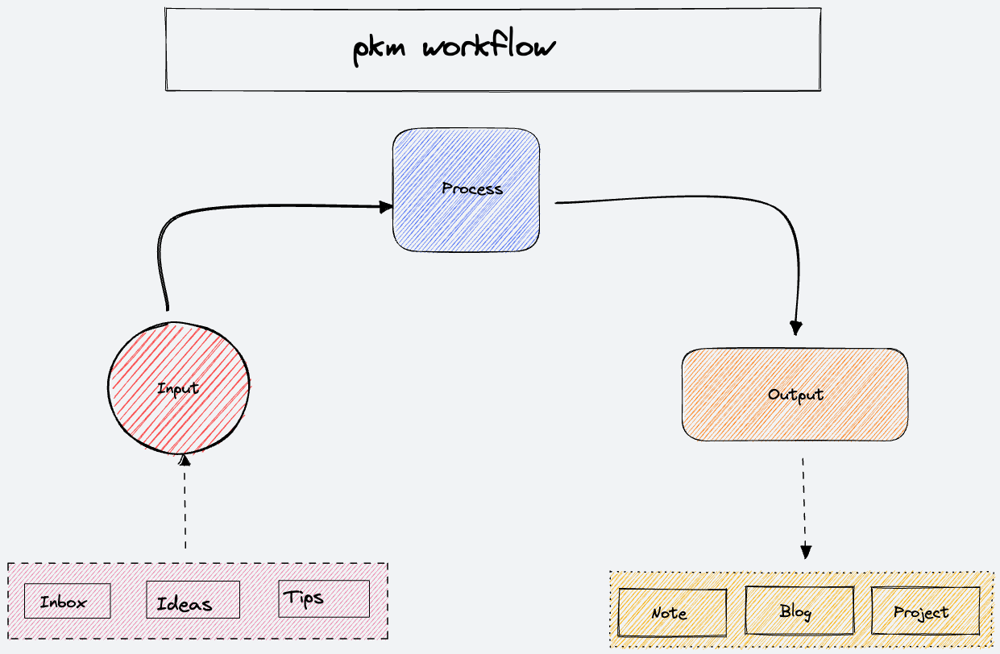
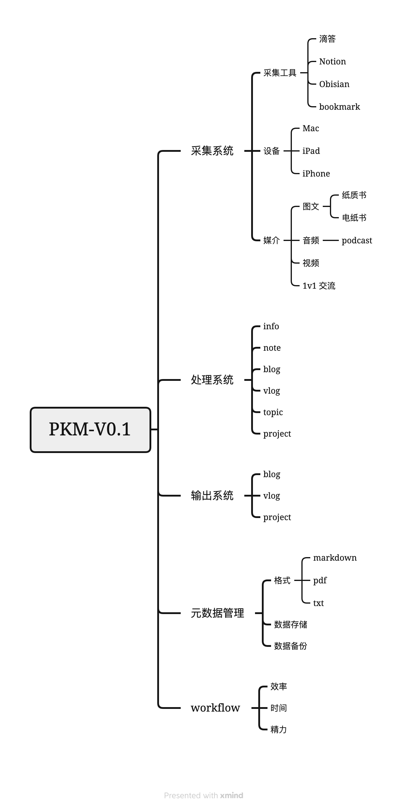
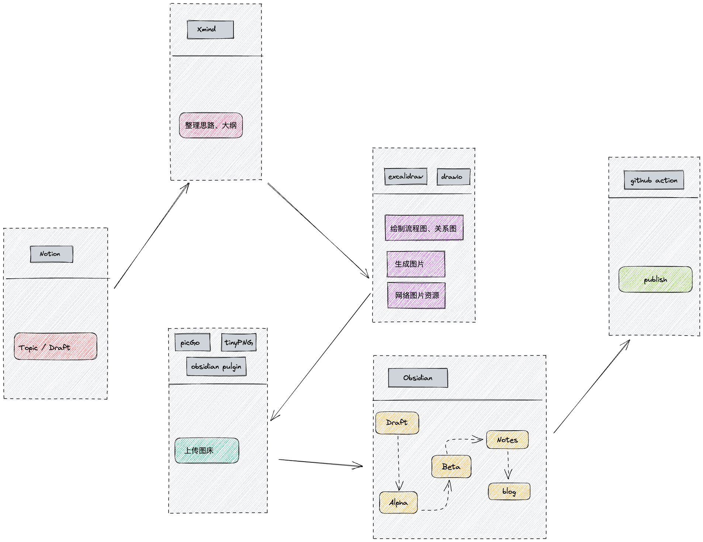
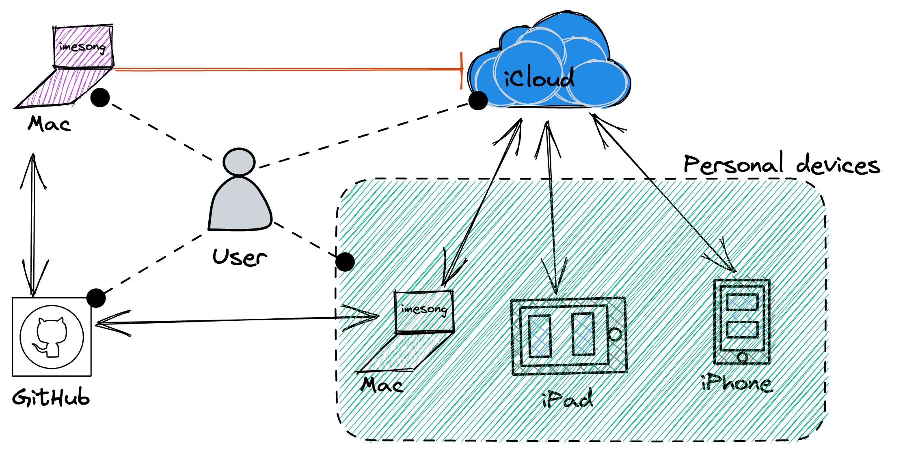

个人知识管理系统( `Personal Knowledge Management` )简称 `PKM` ，在搭建 PKM 之前，需要回答几个核心的问题

- 知识是什么？
- 信息、知识、技能、经验、智慧有什么区别？
- 知识管理的目的是什么？

一个完备的 `PKM`，包括信息的采集、处理和输出。pkm 的运行流程如下

在搭建 PKM 过程中，会借助各种工具，不断提高系统的效率、流畅度。

<!--more-->

pkm v0.1 版本的框架如下

## 采集系统

采集系统主要用来收集信息，包括主动获取信息，被动接受信息。信息碎片化愈发严重情况下爱，一个高效的信息采集系统，能够帮助降低信息噪音，屏蔽垃圾信息。

采集系统从不同维度分析，会有多种表现

### 信息获取介质

信息可以通过不同的介质传播，采集系统更需要支持常见的传输介质，包括图文、音频、视频。v0.1版本只支持图文。

### 信息获取途径

工作、生活中，除去睡眠时间，剩下的时间都有 iPhone、Mac 陪伴。信息时代，主要通过手机、电脑获取信息。

在电脑上，习惯使用 Chrome 浏览信息，遇到感兴趣的信息，通过 Save to Notion ，收藏到 Notion 的 Inbox database 中。

滴答小助手2023年5月1日后，非会员不可以使用。udpate 2023年5月8日。
在 iPhone 上，主要通过微信公众号，获取自己感兴趣的东西。感兴趣的内容会分享给 `滴答小助手` ，临时存储在 `滴答清单` 的收件箱中。在其他的 App 中，如掘金，极客时间，Chrome 浏览器等，如果需要采集信息，也都是分享到 `滴答清单` ，保存在收件箱中。

在公司内部，也有很多高质量的文章、博客，遇到感兴趣的，先收藏到 Chrome 的 `书签栏` ,或者保存快捷方式到个人的飞书文档空间中。

信息的采集主要通过 `滴答小助手` 公众号 和 `Save to Notion` Chrome 插件。滴答小助手重点采集 iPhone 端， Chrome 插件采集 Mac 电脑端，相互配合，各有所长。

## 处理系统

信息处理系统名字暂定 Sbrain(第二大脑)，处理系统是IPO 模型( Input→Process→Output)中的 P，是最关键的一个环节。

处理系统中有几个名词，约定如下

- Info: 信息，一般指 Notion Inbox 和 滴答清单收件箱中采集的网页文章，临时的想法等，信息的内容可多可少，可大可小，没有经过个人主观的判断。一条 Info 可以产生一个 note，也可能是多个。info 和 note 是多对多的关系。
- Note：PKM 系统中的最小节点，具有原子性，可以自解释。
- Knowledge：note 的信息经过汇总、整理，可以输出为 knowledge。knowledge 在深入度、广度上有一定的要求。
- Project：project 是一个项目，需要经过一系列的 knowledge，持续的输出。

### [[卡片笔记]]

## 输出系统

在信息处理系统中，已经把输出的方式和流程涵盖了，输出的工具在[[写作工具箱]]中有介绍，主要包括 Notion、Obsidian、 Xmind、PicGo、Excalidraw 、MdNice等。

输出平台包括

- [个人网站](imesong.com)
- 微信公众号

  

## 元数据管理

元数据的管理，主要包括三个方面

- 数据备份
- 数据格式
  - markdown first ，非必要，不适用其他格式
  - 尽量保留源文件，如流程图的 excalidraw ,xmind 等
- 数据存储
  - local first ,本地具有完全的数据权限，能够离线使用。

### 数据备份

源文件备份在两个地方

- iCloud
- github 私人仓库

访问源文件的设备包括个人设备（Mac/iPad/iPhone）和公司 Mac 办公电脑

- 个人设备：具有iCloud、github 完整的数据读写访问权限
- 公司Mac办公电脑：~~不可以访问 iCloud~~，现在可以访问 iCloud（update 20230401），具有github私人仓库的读写权限

