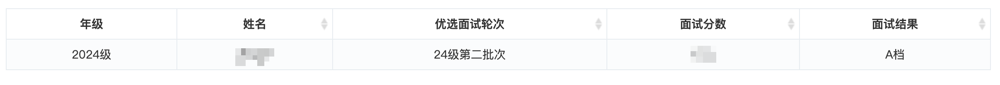
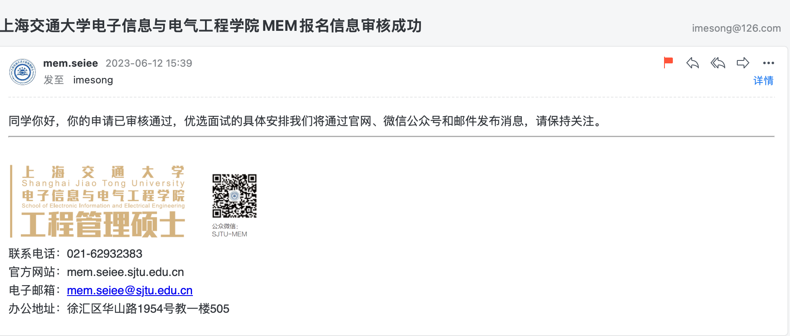
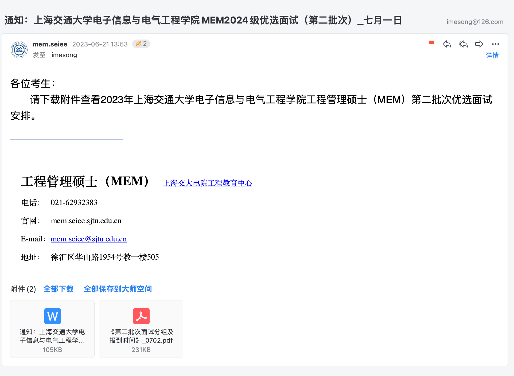
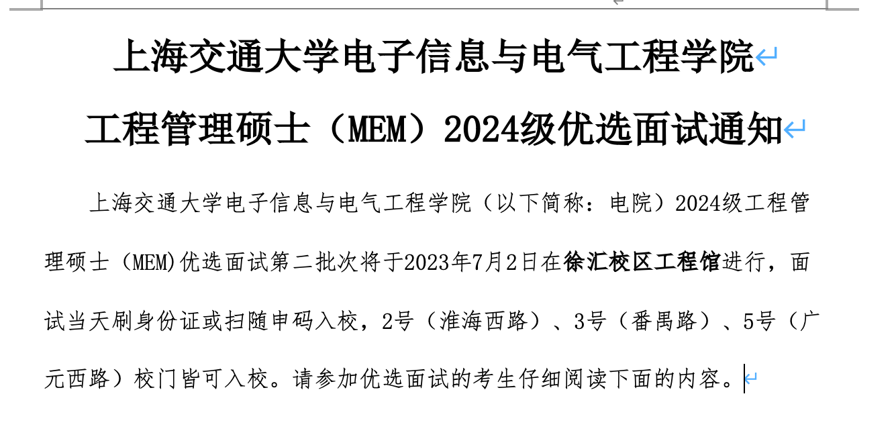
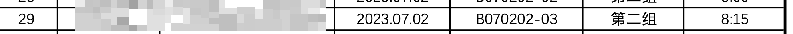

记录上海交大 2024 MEM 面试准备过程，分享 **A档** 面试经验

如果你也在备考 2024 年 MEM，可以添加我的个人微信 **imesong2012** ，备注 **交大MEM备考**，一起学习交流，共同上岸。

<!--more-->

## 注册账号

[上海交通大学电子信息与电器工程学院](https://mem.seiee.sjtu.edu.cn/mem/index.htm)

[优选系统注册/登陆地址](https://app.seiee.sjtu.edu.cn/meme/web/register)

## 基本材料撰写

## 申请人自述

> 申请人自述包括四个问题，我只回答了前三个，下面是我的准备材料

### 现在工作单位的组织架构，您在其中扮演的角色和相关职责

当前在北京字节跳动科技有限公司，是一名客户端研发人员，主要负责 Tiktok 国际化电商客户端研发业务的支持。Tiktok App 在全球（不包括中国）每天有超过 10亿人使用，TikTok 电商是字节跳动国际化电商中最重要的业务之一。

Tiktok 电商当前在东南亚、中东、以及欧美市场快速扩张，有非常大的增长潜力，同时也面临很多挑战。我当前在团队中主要负责中东以及欧美市场客户端的研发支持，主要的工作职责包括：

1. 作为中东、欧美市场客户端货架电商技术负责人，支持业务达成核心目标，包括营收、市场占有率、电商渗透率等。

2. 带领研发团队，保障业务需求的交付效率和质量，对研发结果负责。

3. 制定客户端方向的中长期规划，把控业务中的关键技术点，推进技术架构演进，提高团队技术影响力。

4. 培养团队主动学习、分享氛围，打造学习型组织，提高团队整体技术能力；

### 列举工作中3个最主要的成就，并客观评价自己在工作中的优势和不足

1. 作为客户端负责人，支持国际化电商业务开拓中东市场，在两个月内完成从 0 到 1 到建设。业务上线后，在营收、渗透率、客户评价上超预期完成目标。
2. 在上海二三四五移动科技有限公司期间，作为公司客户端负责人之一，统一公司多个移动端产品的基础建设，包括基础架构、技术选型、技术方案、依赖管理等，提高App研发效率，降低业务维护成本。
3. 不设边界，勇于面对技术挑战，通过技术驱动业务发展。作为一名客户端研发人员，在协作部门人员紧张情况下，带领团队主动学习跨端技术栈，在两个月内完成运营配置系统的搭建和上线，解决营销活动配置效率低、维护性差的问题。
   **优势**

4. 在工作中拥有良好的技术判断力，能够结合业务诉求、时间、人力成本及风险等，合理的评估不同的技术方案，在更大范围内寻找最优解。
5. 作为研发人员，在支持业务的同时，具有一定的业务敏感度和产品意识，能够围绕核心业务目标，与业务人员进行有效、充分的讨论，从而在技术实现上更好的支持产品需求。
   **不足**

6. 做事比较谨慎，在制定规划、落地方案时，相对比较保守，缺乏除旧革新的魄力，创新能力稍显不足。
7. 工作中冲突管理的能力不足， 比较缺乏“斗争”经验，更多的是合作型人格。

### 未来5年内，给自己设定的职业目标是什么，您希望通过在交大的MEM学习到哪些知识助力您的目标达成

- 五年以后，能够胜任复杂产品的技术负责人，带领多个职能团队，完成产品的开发和团队管理工作；
- 五年以后，对所在行业有深刻的理解，对行业未来的发展方向有清晰的认知和规划，成为领域内比较资深的人员。
- 希望在交大的 MEM 学习中，拓展技术视野，了解行业发展趋势，完善管理方向的理论知识，包括工程管理、项目管理、供应链管理等。结合日常管理工作实践，形成个人管理风格，有自己的管理方法论。
- 希望在交大的平台上，相识更多优秀的老师、同学，与优秀的人，一起做一些有价值的事，探索更多的可能性

### 除了以上所有的已填信息外，你以为我们还需要了解一些什么？

- 暂无

## 提交材料

基本材料撰写完成后，按照提交时间要求，尽早提交材料。提交后，会进入审核流程，审核成功后，会收到报名成功的邮件。剩下的就是好好准备面试了。

## 个人面试准备

我的面试准备包括两个部分

1. 充实面试材料中的内容，补充详实的例证。
2. 个人模拟面试，针对可能遇到的问题做一下简单的准备，尤其是热点问题（国际热点，Tiktok 封禁等），经典问题（主要业绩、优势、未来规划）。后来证明，这部分的准备很有必要，面试中的好几个问题，都是提前准备了一下。
3. 英文准备，主要包括：自我介绍、日常工作描述、热点问题等

### 评委可能的问题

1. 数据合规与安全，如何看待美国对 Tiktok 封禁问题？（命中）
2. 人工智能火热趋势，如何看待 chatGPT 对行业的影响？
3. 国际化中的问题（命中）
4. 管理能力的深度，业务的广度（命中）

## 个人面试经验分享

我参加的是2024年第二批次的交大MEM优选面试，7 月 2 日（周日）面试，可能是我申请材料提交的比较早，分在了上午的第二批次。

面试时间、地点及流程

面试分组

### 面试流程

面试流程主要包括五个部分，面试材料需要自己打印五份。

1. 报到：签到、确定面试的教室
2. 拿面试卡：等待面试
3. 面试：～
4. 归还面试卡：平复下激动的心情
5. 结束：回家喽

### **我被问到的问题**

1. 自我介绍 5分钟
2. 英文问题
   - 相对其他面试者，你的主要优势是什么？
   - 工作中的主要成绩
3. 主要工作是什么？和一位老师解释了很久，Tiktok 的国际化电商 “是什么? 怎么做的? 我在团队里主要负责的是什么?”。
4. 工作中主要挑战，怎么解决的？
5. 跨国团队工作中面临哪些问题，如何解决的？
6. 面临的挑战，在国外被封禁、打压
7. 个人有没有一些专利、软著
8. 开源的项目，基于chatGPT的个人助理（文本总结、概括）
9. 为什么想要学习 MEM，未来的规划是怎样的

我在面试中的这几个问题，就不分享参考答案了，面试结束时，和一位老师交流时说到：**“你的准备材料不是很充分啊，稍微有一些………”**,另一位老师附和道**“是的，显得有一些粗糙”。** 听到老师这样评价，我顿时感觉：“糟糕，这次完了，回去要总结失败的经验了”

后来我想了一下，老师这样说的初衷。可能对比其他同学，我没有提交更多的补充材料，比如：各种获奖证书、论文、软著等。我提交的面试材料只有 2 张 A4 纸，为了能够在两页纸上能够放下，描述文字也使用了一些比较抽象、甚至是互联网的“黑话”，这些文字，老师阅读了可能并不感冒。

我也有一些证书，但个人都觉得含金量不高，只是在面试申请材料提了一下，并没有提交材料原件。

- 英语六级证书
- PMP
- 软著及专利

关于补充材料，建议大家有时间，可以准备充分一些，面试时尽量把原件提交给老师看一下，至少是个加分项。
