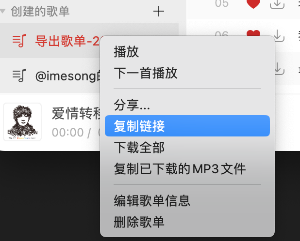
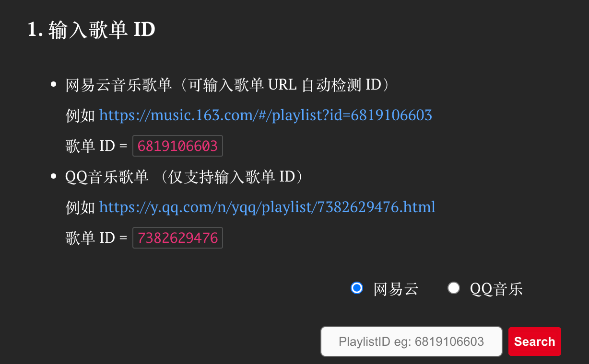
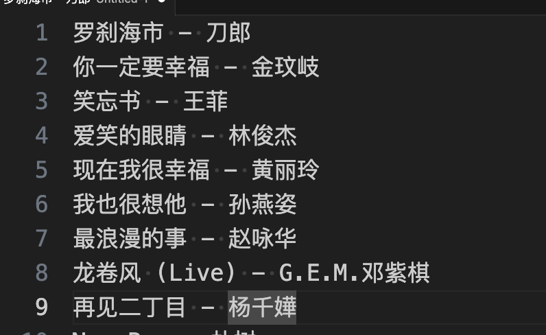
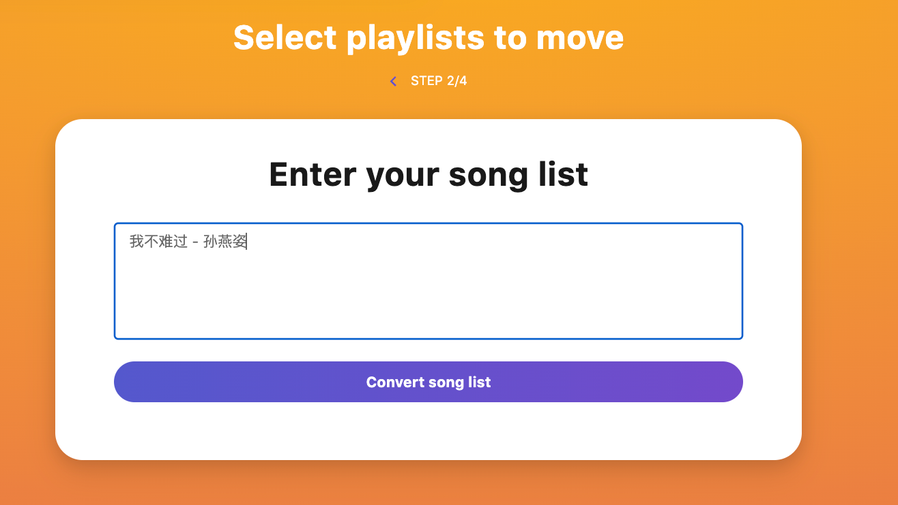
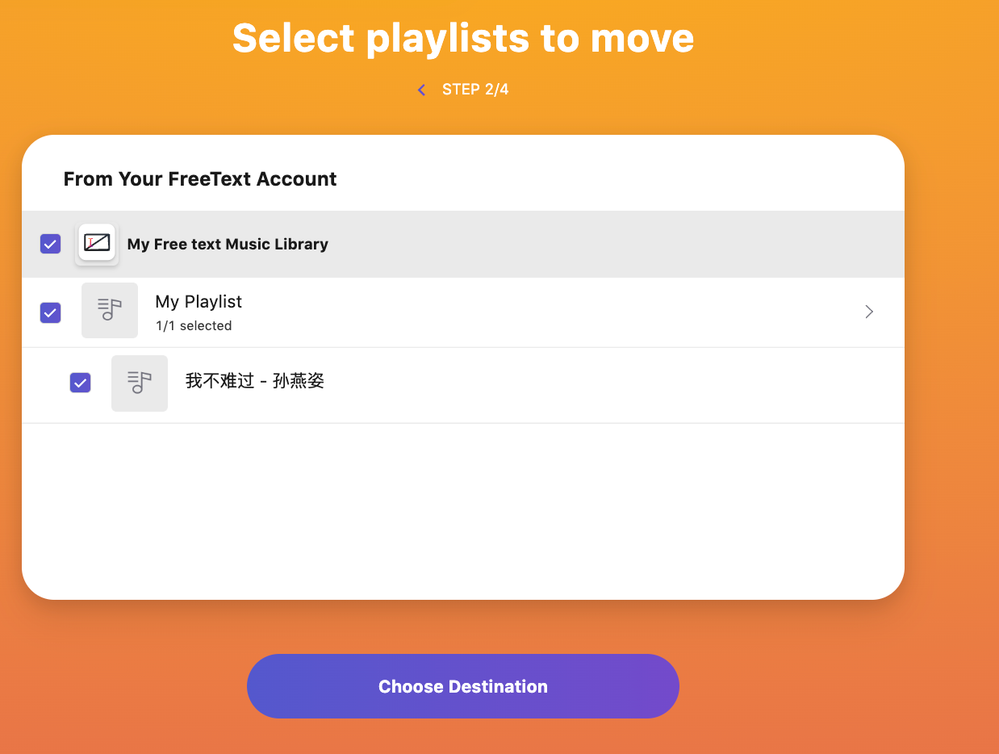
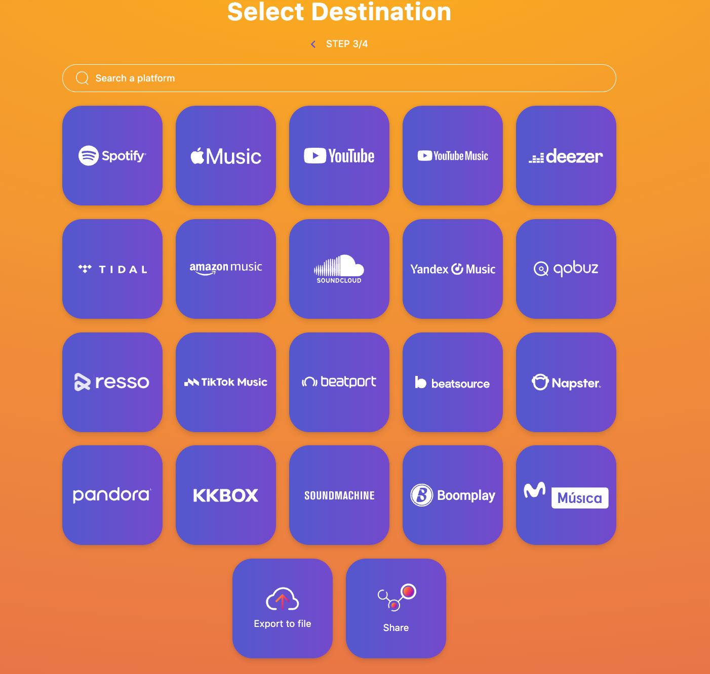
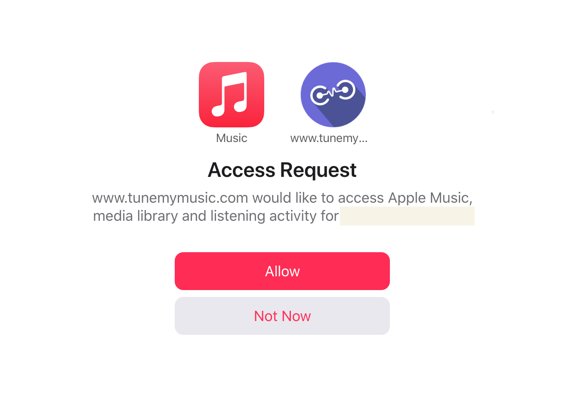
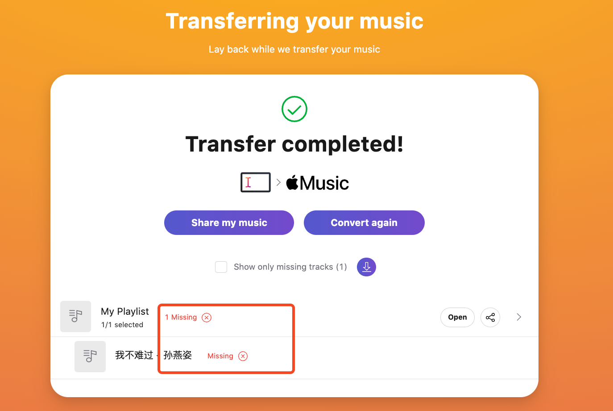

## 导出网易云歌单

1. 获取歌单 id 或 歌单 URL

   

   获取歌单id/url

比如，我的歌单地址如下，标黄的部分为歌单 `id`

[https://music.163.com/playlist?id=8698386250&userid=44179060](https://music.163.com/playlist?id=8698386250&userid=44179060)

1. 打开 [https://yyrcd.com/2018/11/14/n2s-zh/](https://yyrcd.com/2018/11/14/n2s-zh/)， 输入歌单 id 或者歌单的URL

歌单示例

输入歌单ID/URL

<aside>
💡 导出网易云歌单，会有很大的失败概率，无法获取到网易的歌单内容，需要多试几次

</aside>

1. 复制导出的歌单文字

导出的文字歌单，格式如下，·歌曲名 - 歌手·

## TurnMyMusic 导入 AppleMusic

从 [TurnMyMusic](https://www.tunemymusic.com/transfer) 到入歌单需要 `4` 步。

1. 选择导入源
2. 完成 Apple Music 授权
3. 开始导入
4. Done

导入到 AppleMusic 中，会有部分歌曲没有，或者导入失败。

